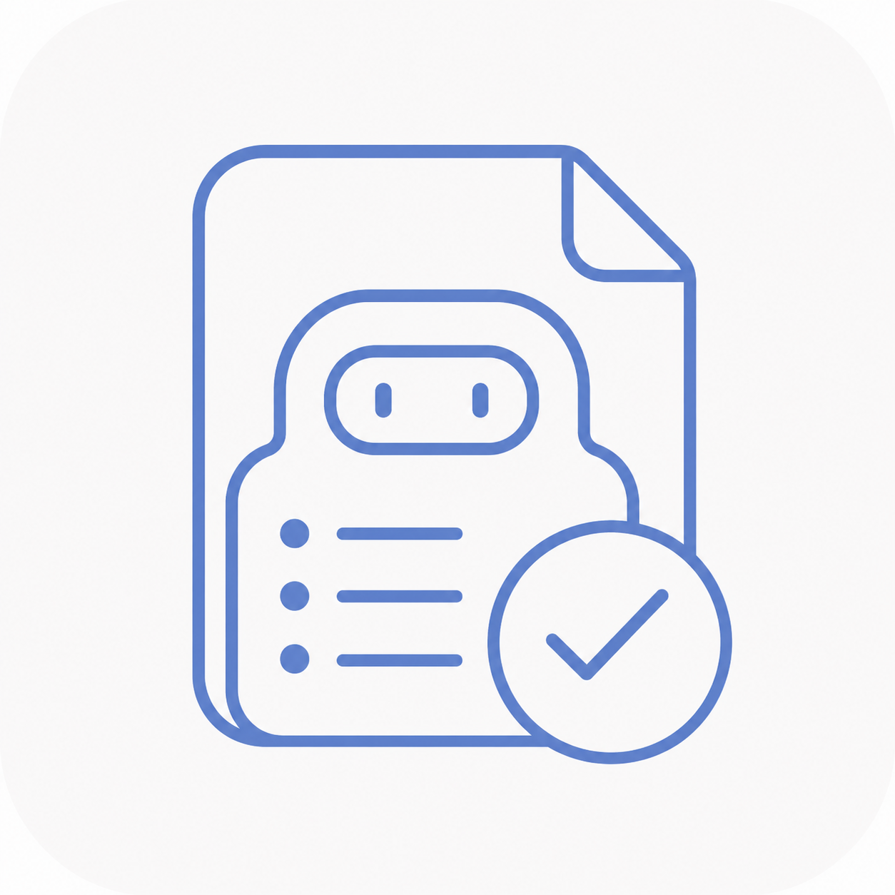

<p align="center" style="margin-bottom: 6px;">
  
</p>

<h1 align="center" style="margin-top: 0;">Talent Hub</h1>

<p align="center">
  <em>A local-first, evidence-driven AI talent workbench that supports key hiring decisions with verifiable, deliverable assistance.</em>
</p>

<p align="center">
  English · <a href="README.md">简体中文</a>
</p>

<p align="center">
  
  
  
  
  
</p>

<p align="center">
  
  
  
  
</p>

> [!IMPORTANT]
> AI results are hiring assistance only — never an automatic hire-or-reject decision. HR and hiring managers always keep the final call.

## Table of contents

- [What it solves](#what-it-solves)
- [HR productivity scenarios](#hr-productivity-scenarios)
- [Current capabilities](#current-capabilities)
- [Technical highlights](#technical-highlights)
- [Quick start (development)](#quick-start-development)
- [Application settings](#application-settings)
- [Feishu push setup (optional)](#feishu-push-setup-optional)
- [Windows build](#windows-build)
- [macOS build](#macos-build)
- [Data & security](#data--security)
- [Project layout](#project-layout)
- [Limitations](#limitations)

## What it solves

During peak hiring, HR gets buried in repetitive work and real time for judgment keeps shrinking:

- **More resumes than there is time to read** — screening means reading every one; under pressure it's easy to score on instinct and miss good fits.
- **Inconsistent standards, hard-to-explain calls** — different people, different days, different verdicts, and there's no grounding for keeping or dropping someone when candidates or hiring managers push back.
- **Key steps scattered across tools** — screening, phone checks, and result organizing live in separate places, so information gets fragmented, easily missed, and hard to turn into reusable records.

Talent Hub ties the most time-consuming, judgment-heavy steps into one flow: every call has a traceable basis, uncertain points are flagged, and results are ready to use. Settings, task materials, and results are stored locally by default; when model, ASR, or Feishu features are used, the corresponding content is sent to the configured service.

## HR productivity scenarios

| Step | The usual bottleneck | After Talent Hub |
| --- | --- | --- |
| **Bulk screening** | Dozens to hundreds of resumes, read one by one and scored on instinct, so the bar shifts and good candidates get missed. | Upload a role description and a stack of resumes; get a tiered shortlist screened against one consistent standard at a glance. |
| **Justifying & reviewing calls** | Candidates ask where they stand and hiring managers want the "why", but the reasoning isn't grounded; reviewing means re-reading everything. | Each judgment comes with a traceable basis, anything uncertain is flagged, and review only checks the evidence — no more full re-reads. |
| **Phone confirmation** | Play back recordings, jot notes by hand, then organize and archive — slow and easy to miss things. | Upload recordings for several candidates at once; the key points are organized and anything uncertain is flagged, then reviewed and exported for records. |
| **Delivering results** | Lists and notes live in different tools with no uniform format, so consolidating takes time and invites mistakes. | Automatically produce one unified evaluation outcome and shortlist, ready for scheduling and archiving. |
| **Sharing results** | Watching progress at the computer, then manually formatting and forwarding the outcome to the group to keep teammates in the loop. | When a task finishes, the result summary is pushed automatically to your Feishu group, so you see the ranking and calls from your phone — no refreshing, no manual forwarding. |

## Current capabilities

Currently supported modules — more will follow:

### Resume screening

| Capability | Description |
| --- | --- |
| **Criteria first** | Generates the job essence, target profile, business scenarios, key actions, hard requirements, negative signals, and A/B/C decision rules from the JD. |
| **Evidence-driven evaluation** | Match and mismatch judgments must be grounded in the resume source: direct quotes are preferred, and reasonable inference from the full experience is allowed; judgments with no traceable basis in the source are downgraded or sent to manual review. |
| **Tiered recommendations** | Code applies one state machine: a supported hard/core mismatch is C, an unknown hard/core fact is B, and all required checks passing is A. |
| **Batch evaluation** | Supports 1–12 concurrent candidates. Each resume follows one evaluation flow, but retryable transport errors or failed JSON/structure validation can trigger another model request. One parsing or model-request failure does not stop the remaining resumes. |
| **Saved partial results** | Each successful evaluation is saved locally immediately; if batch finalization fails, completed candidates remain viewable and the run can be restarted, while download, append, and notification actions stay unavailable until formal artifacts exist. |
| **Side-by-side comparison** | Compares up to 20 A/B candidates; code keeps every A ahead of every B, while AI only orders candidates within the same tier and explains why. |
| **Multi-format parsing** | Supports PDF, DOCX, TXT, Markdown, and common image formats; scanned documents can use Tesseract OCR. |
| **Deliverable results** | Generates and validates a five-sheet Excel workbook (candidate summary, evidence matching, phone-confirmation questions, screening criteria, recommendation list) plus Markdown screening criteria. |

### Phone screening

| Capability | Description |
| --- | --- |
| **Batch transcription** | Upload multiple recordings (m4a / wav / mp3 / ogg / opus) powered by Volcano Engine ASR. |
| **AI summarization** | Uses a senior-recruiter perspective to produce structured notes, soft-skill evaluations that prioritize the selected focus dimensions without being limited to them, and optional Q&A detail (off by default). |
| **Structured result delivery** | Code validates JSON and required structure only. It does not delete model-produced notes or soft-skill evaluations or change field status based on citations; citations are used only for audio positioning. |
| **Manual review & download** | Date-based default task titles follow the interface language while manual titles remain unchanged; after per-candidate review, export a Markdown record for each candidate. |

### Feishu push

| Capability | Description |
| --- | --- |
| **Auto notification on completion** | Pushes results to a designated Feishu group when resume screening or phone screening finishes. |
| **HR-focused result messages** | Each resume-screening run sends one overview with submitted/successful/failed counts, A/B/C distribution, and one-line judgments for up to five A/B candidates. Phone screening sends one organized record per candidate; records over the per-message limit are truncated with a prompt to return to the app. |
| **Incremental deduplication** | Appended resumes notify only newly evaluated results and include the cumulative role total; appended recordings send only entries not yet pushed successfully; a full re-screen after criteria changes is notified as a new version. |
| **Reliable delivery** | Transient network errors, HTTP 429, and 5xx responses receive limited retries with rate limiting; push failures are recorded without changing the screening or phone task's business status. |
| **Manual resume-notification retry** | From a completed resume-screening result, click "Retry Feishu notification" to send only pending results and see whether this attempt sent anything. The phone task view has no manual retry action. |
| **Test Feishu link** | One-click test message in Settings to verify Webhook connectivity. |

## Technical highlights

- **Local-first**: settings, original task materials, and results are stored in the user data directory by default (Windows: `%LOCALAPPDATA%\TalentHub`; macOS: `~/.local/share/TalentHub`), which is outside the source tree. When overridden with `TALENT_HUB_DATA_DIR` or `--data-dir`, the operator chooses the location. Parsed resume text is saved only when "Retain parsed text" is enabled.
- **Key security**: Windows encrypts model, ASR, and Feishu signature keys with the current user's DPAPI; macOS uses environment variables for secrets.
- **Loopback isolation**: the service listens on `127.0.0.1` only and generates a per-session token at startup.
- **Fairness safeguards**: model prompts prohibit using age, sex, ethnicity, place of origin, marital status, or reproductive status for evaluation or ranking. Code also filters hard requirements, A/B/C conditions, and negative signals against its built-in protected-attribute terms. These safeguards do not replace human bias review.
- **Frontend**: React + TypeScript frontend (Vite build), served by FastAPI.
- **Optional Feishu notifications**: pushes result summaries via a Feishu custom bot Webhook, with no new third-party dependency.

## Quick start (development)

**Prerequisites**: Windows or macOS, Python, Node.js and npm, and an OpenAI Chat Completions-compatible model service.

1. Install dependencies:

   ```powershell
   python -m pip install -r requirements.txt
   ```

2. Build the frontend (the backend serves the `frontend/dist` build output):

   Windows:

   ```powershell
   cd frontend
   npm ci
   npm run build
   ```

   macOS:

   ```bash
   cd frontend && npm ci && npm run build
   ```

   > Windows shortcut: after installing the Python and frontend dependencies, double-click `start-app.bat` in the project root. It starts the backend and runs `npm run build -- --watch` to rebuild frontend changes automatically, but it does not run `npm ci`; refresh the page to see frontend changes.

3. Start the app:

   Windows:

   ```powershell
   python -X utf8 -m app.main
   ```

   macOS:

   ```bash
   export TALENT_HUB_API_KEY="your model API key"
   python -X utf8 -m app.main
   ```

The app opens your default browser on startup. On first use, enter the model service base URL, API key, and model name in Settings, then test the connection; on macOS, configure secrets with environment variables.

> [!NOTE]
> Text-based PDF, DOCX, TXT, and Markdown need no OCR. For scanned PDFs or images, install Tesseract (and the `chi_sim` language pack for Chinese resumes). The app checks `TESSERACT_CMD`, `PATH`, and common platform paths automatically; enter the executable path in Settings only if detection fails. On macOS, install it with `brew install tesseract tesseract-lang`.

## Application settings

The Settings dialog (top-right) centrally manages the options below. "Model base URL / API key / Model name" are required; the rest are optional or tuned on demand.

| Setting | Default / range | Description |
| --- | --- | --- |
| Model base URL | `https://api.openai.com/v1` | An OpenAI Chat Completions-compatible service with JSON output. Enter the base URL without `/chat/completions`; the app appends that path and does not require the URL to end in `/v1`. |
| API key | empty | Model service access key; Windows encrypts it with DPAPI, while macOS uses the `TALENT_HUB_API_KEY` environment variable. |
| Model name | empty | The model identifier to use, as defined by your model provider. |
| Concurrency | 6 (1–12) | Number of candidates processed in parallel per batch. Increasing it raises parallel throughput; actual duration depends on candidate count, model latency, and provider rate limits. Lower it when rate-limited. |
| Request timeout (seconds) | 180 (30–600) | Timeout for each ordinary model HTTP attempt. Each criteria-generation call and resume-evaluation call allows up to 3 and 2 retryable transport attempts, respectively; failed JSON/structure validation can start one more corrective call. Each phone-summarization call uses at least 300 seconds per attempt and allows up to 3 retryable transport attempts; failed structure validation can also start one more call. |
| Tesseract path | empty | Tesseract executable path for scanned PDFs or image resumes. When empty, the app checks `TESSERACT_CMD`, `PATH`, and common platform paths. Text PDF/DOCX/TXT/Markdown need no OCR; install the `chi_sim` language pack for Chinese resumes. |
| Retain parsed text | on | Whether to keep each resume's parsed text locally. When off, those texts are not saved, while parsed JD text and the parsing manifest without resume bodies remain stored. |
| Speech-to-text key | empty | Volcano Engine large-model speech recognition (audio-file fast version) API key; Windows encrypts it with DPAPI, while macOS uses the `TALENT_HUB_ASR_API_KEY` environment variable. |
| Generate phone screening details (Q&A transcript) | off | When enabled, phone summarization also produces a full Q&A transcript; leaving it off reduces model output length and processing time. |

### Speech-to-text (Volcano Engine) setup

Phone-call transcription uses **Volcano Engine large-model speech recognition (audio-file fast version)** and needs just one API key.

1. Open the [Volcano Engine Speech / Doubao voice console](https://console.volcengine.com/speech/app) and log in (register and complete real-name verification first if needed).
2. Create an app and be sure to select **"Audio-file fast version / Large-model speech recognition fast version"** (resource `volc.bigasr.auc_turbo`); do not pick the standard or streaming variant, which cannot transcribe local files.
3. In the console's "API key" page (new console), copy the **API key**.
4. On Windows, paste that key into "Speech-to-text key" in Settings and save; on macOS, set `TALENT_HUB_ASR_API_KEY` before launch.

> [!NOTE]
> Transcription is billed by Volcano Engine by transcript duration; check the free allowance and resource packs in the console first. Original recording content is sent to Volcano Engine ASR for transcription. The transcript is sent to the configured model service to generate the organized call record. Original recordings, transcripts, and organized records are saved in the local data directory.

### Environment variables (optional)

| Variable | Description |
| --- | --- |
| `TALENT_HUB_API_KEY` | Injects the model API key via environment variable. On Windows, a saved key takes precedence and this variable is a fallback; on macOS, use this variable for the model key. |
| `TALENT_HUB_ASR_API_KEY` | Injects the Volcano Engine ASR API key via environment variable; macOS uses this variable for speech-to-text. |
| `TALENT_HUB_FEISHU_SIGN_SECRET` | Injects the Feishu bot signature secret via environment variable; the Webhook URL can still be saved in Settings. |
| `TALENT_HUB_DATA_DIR` | Overrides the default data directory (Windows: `%LOCALAPPDATA%\TalentHub`; macOS: `~/.local/share/TalentHub`) for settings, task materials, and result files. Parsed JD text is saved; parsed resume text is saved only when "Retain parsed text" is enabled. The operator is responsible for keeping a custom path outside the source tree. |
| `TESSERACT_CMD` | Specifies the Tesseract executable path; if unset, the app tries `PATH` and platform-specific common locations. |

## Feishu push setup (optional)

When enabled, each resume-screening run pushes one business overview, while phone screening pushes one organized record per candidate. Appended work notifies only new results that have not been pushed successfully; a full re-screen after criteria changes is notified as a new version.

The bot-creation labels below belong to Feishu and may vary with its client interface. Talent Hub only consumes the resulting Webhook URL and optional signature secret.

1. In the Feishu desktop client, open the target group → top-right settings → Group bots → Add bot → **Custom bot** → set a name and add it.
2. Copy the generated **Webhook URL** (e.g. `https://open.feishu.cn/open-apis/bot/v2/hook/xxxx`).
3. In the app's Settings dialog, under the "Feishu push" section: check "Automatically push results to the Feishu group when tasks finish", paste the Webhook URL, click "Test Feishu link" to verify, then save.

> [!TIP]
> - If signature verification is not enabled, leave the signature secret blank. If it is enabled, enter the generated secret in "Feishu push · Signature secret" on Windows; on macOS, set `TALENT_HUB_FEISHU_SIGN_SECRET` before launch.
> - Talent Hub does not automatically insert custom keywords or adapt to an IP allowlist. Before enabling either Feishu-side rule, ensure that the app's messages and request source satisfy it.
> - Resume messages contain statistics, candidate names, conclusions, and one-line judgments. Phone messages contain the organized record shown in the app, but do not separately append the raw transcript, facts list, or citation fields. Oversized phone messages are truncated with a prompt to view the full record in Talent Hub.
> - Before sending, the app replaces common mobile-number, landline, and email formats. Unusual formats may not be detected, so confirm that the message content is suitable for the target group before enabling push.

## Windows build

1. Install build dependencies:

   ```powershell
   python -m pip install -r requirements-build.txt
   ```

2. Run the build script:

   ```powershell
   .\scripts\build_windows.ps1
   ```

The portable executable is written to `release\<version>\portable\TalentHub\TalentHub.exe`; end users do not need Python. When Inno Setup 7 or 6 is detected, the installer is written to `release\<version>\TalentHub-Setup-<version>.exe`; otherwise only the portable build is produced. The script generates the icon, version information, and third-party notices, then runs health-check and startup smoke tests on the portable app.

## macOS build

macOS artifacts must be built on macOS. Install build dependencies explicitly before building:

```bash
python -m pip install -r requirements-build.txt
bash scripts/build_macos.sh
```

The script creates `dist/TalentHub.app` and `release/<version>/macos/TalentHub-macOS-<version>.zip`, then runs a local startup smoke test. The macOS package is currently unsigned and not notarized; organization distribution should add Apple Developer ID signing and notarization.

## Data & security

- App data is stored by default on the user's machine (Windows: `%LOCALAPPDATA%\TalentHub`; macOS: `~/.local/share/TalentHub`), including settings, original task materials, parsed JD text, result files, phone transcripts, and organized records. Parsed resume text is saved only when "Retain parsed text" is enabled.
- On Windows, API keys, ASR keys, and Feishu signature secrets are encrypted with DPAPI; on macOS, secrets are provided through environment variables. Plaintext secrets are never returned by the API.
- The service listens only on the loopback address, and all API requests require a session token.
- When criteria are generated, the job description is sent to the configured model service; when candidates are evaluated, parsed resume text is sent to that model service. For phone screening, original recording content is sent to Volcano Engine ASR, and the transcript is sent to the model service. Evaluate each provider's data handling and compliance before use.
- Feishu push sends the configured message content to Feishu servers through a Webhook. The app replaces common mobile-number, landline, and email formats, but unusual formats may not be detected. Keep the Webhook URL private and review outbound content before enabling push.
- Keep manual review for critical roles, campus hires, scarce talent, and high-risk rejections.

## Project layout

| Directory | Description |
| --- | --- |
| `app/` | FastAPI service, screening & phone pipelines, model client, runtime tools |
| `frontend/` | React + TypeScript frontend project (Vite build) |
| `packaging/` | PyInstaller and Inno Setup packaging config |
| `scripts/` | Build and release verification scripts |
| `docs/references/` | External background reference files (not part of the app) |
| `assets/` | Application icon assets |

## Limitations

Screening and phone-summarization accuracy depends on JD clarity, resume/recording parsability, model and ASR capability, service stability, and role criteria. Resume screening uses evidence checks for tiering; phone summaries use a senior-recruiter prompt, produce structured results, and remain subject to HR review. Protected-attribute filtering, prompt constraints, and format-based redaction do not replace human review. The system cannot promise zero errors, and final hiring decisions must be made by authorized personnel.
